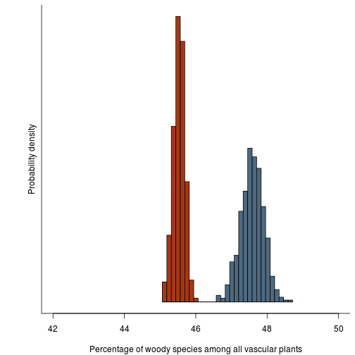
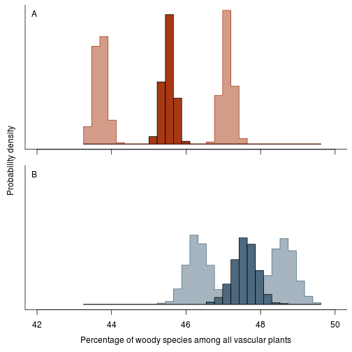
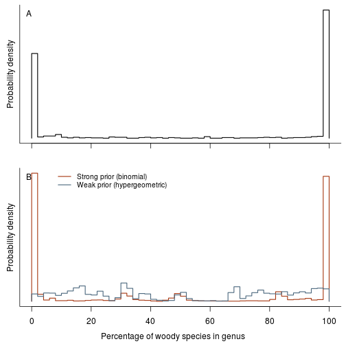
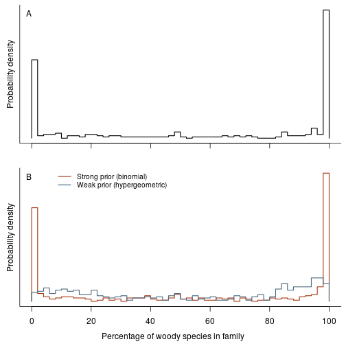
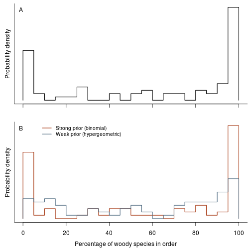
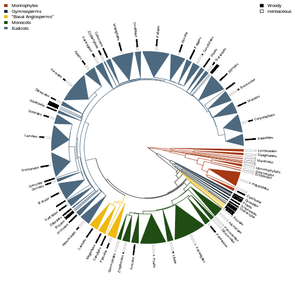
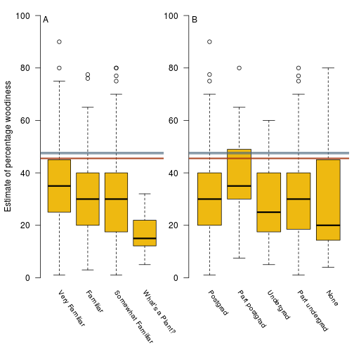
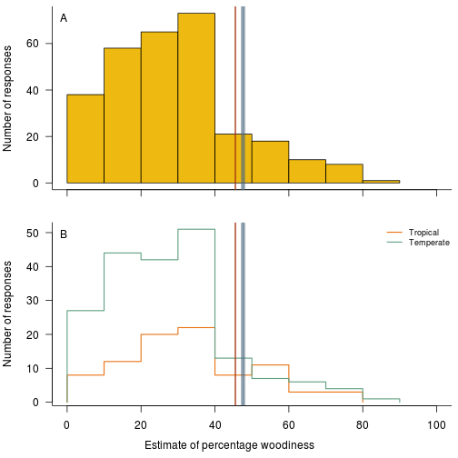
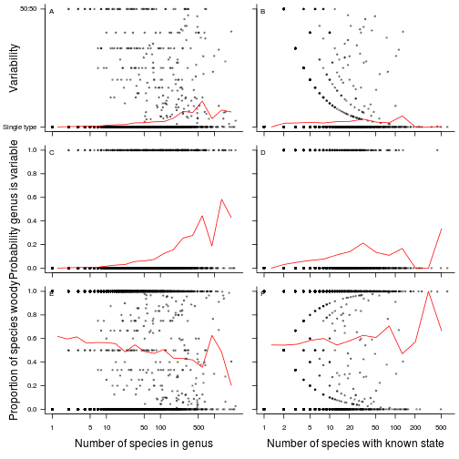

```r
library(diversitree)
```

```
## Loading required package: deSolve
## Loading required package: ape
## Loading required package: subplex
## Loading required package: methods
## Loading required package: Rcpp
```

```r
# Fetch the Zanne et al data from Dryad
source("data/zae/download.R", chdir = TRUE)
```

```
## Warning: package 'assertthat' was built under R version 3.0.2
```

```r
source("wood-functions.R")
```


We're going to put some partly processed data here.

```r
dir.create("output", FALSE)
```


Colours used throughout:

```r
cols.methods <- c(binomial="#a63813",
                  hypergeometric="#4d697f")
cols.tree <- c(Monilophytes="#a63813",
               Gymnosperms="#21313b",
               BasalAngiosperms="#eeb911",
               Monocots="#204d14",
               Eudicots="#4d697f",
               Rest="gray15")
cols.woody <- c(Woody="#533d0c",
                Herbaceous="#799321")
cols.woody <- c(Woody="black",
                Herbaceous="white")
cols.shading <- "#eeb911"
cols.tropical <- c(tropical="#ea7518",
                   temperate="#62a184")
```


The 'load.woodiness.data.genus' function hides a reasonable amount
of data cleaning required to load the data.  This mostly involves
matching the woodiness data set from Zanne et al. to our species
list (derived from The Plant List), cleaning up synonomies, and
then collapsing down to genus.

```r
##
```

The final object has columns
* genus, family, order -- taxonomic information
* W, V, H              -- number of species scored as woody,
                          variable, herbaceous (respectively)
* N                    -- number of species in the genus
* K                    -- number of species with known state,
                          after dropping all "variable" species
* p                    -- fraction of known species that are woody,
                          after dropping all "variable" species

```r
dat.g <- load.woodiness.data.genus()
```

```
## Dropping 9388 species not in Plant List
## 90.1% of species have a valid name; resolving 3925 species
## After synonym correction, 1448 duplicated entries
## Final set: 14680 genera, 7303 with data, 37494 species known
```


Here is the simulator.

For each genus:

A. If the genus has a valid fraction of species (i.e. K > 0 so p is
defined), then sample the number of species that are woody from
either
   - the binomial distribution (strong prior; assuming known
     species were sampled with replacement from the pool of
     species); or
   - the hypergeometric distribution (weak prior; assuming that
     known species were sampled without replacement from the pool
     of species).

B. If the genus has no valid fraction of species (i.e., K == 0 so p
is undefined), then sample from the emperical distribution of
per-genus fractions.  We're going to feed data into this by
taxonomic order, so this will come from the per-order distribution.

```r
sim <- function(x, nrep, with.replacement=TRUE, p=1/20) {
  ## First, focus on cases where we have a valid estimate of the
  ## fraction of species that are woody (i.e., at least one known
  ## species).
  ok <- !is.na(x$p)

  w <- matrix(NA, nrow(x), nrep)

  ## A: genera with any known species
  if (with.replacement)
    w[ok,] <- x$W[ok] + rbinom(sum(ok), x$N[ok]-x$K[ok], x$W[ok]/x$K[ok])
  else
    w[ok,] <- t(sapply(which(ok), function(i)
                       rhyper2(nrep, x$H[i], x$W[i], x$N[i])))

  ## B: genera with no known species
  n.unk <- sum(!ok)
  w[!ok,] <- apply(w[ok,,drop=FALSE] / x$N[ok], 2, function(y)
                   rbinom(n.unk, x$N[!ok], quantile(y, runif(n.unk))))
  
  rownames(w) <- x$genus

  summarise.sim(w, x[c("order", "family", "genus",
                       "W", "V", "H", "N", "K")])
}
```


This collects up the results at different taxonomic levels.

```r
summarise <- function(x, p=1/20)
  structure(c(mean(x), quantile(x, c(p/2, 1-p/2))),
            names=c("mean", "lower", "upper"))
summarise.sim <- function(w, info) {
  order <- info$order[[1]]

  info.cols <- c("W", "V", "H", "N", "K")

  ## Genus is easy;
  w.g <- cbind(info, t(apply(w, 1, summarise)))

  ## Family is a pain:
  w.f <- do.call(rbind,
                 lapply(split(as.data.frame(w), info$family), colSums))
  w.f <- t(apply(w.f, 1, summarise))
  w.f <- data.frame(order=order,
                    aggregate(info[info.cols], info["family"], sum),
                    w.f, stringsAsFactors=TRUE)
  rownames(w.f) <- NULL
  
  ## Order is easy; we are guaranteed to have just one order here, so:
  w.o <- data.frame(order=order,
                    as.data.frame(t(colSums(info[info.cols]))),
                    t(summarise(colSums(w))), stringsAsFactors=FALSE)

  ret <- list(genus=w.g, family=w.f, order=w.o)
  attr(ret, "total") <- colSums(w)
  ret
}

rhyper2 <- function(nn, s0, s1, xn, fraction=FALSE) {
  x1 <- seq(s1, xn - s0)
  x0 <- xn - x1
  p1 <- dhyper(s1, x1, x0, s0+s1)
  p1 <- p1 / sum(p1)
  x1[sample(length(p1), nn, TRUE, p1)]
}

do.simulation <- function(dat.g, nrep, with.replacement) {
  f <- function(level) {
    ret <- do.call(rbind, lapply(res, "[[", level))
    rownames(ret) <- NULL
    ret[c("p.mean", "p.lower", "p.upper")] <-
      ret[c("mean", "lower", "upper")] / ret[["N"]]
    ret
  }

  res <- lapply(split(dat.g, dat.g$order),
                sim, nrep, with.replacement)
  total <- rowSums(sapply(res, attr, "total"))
  overall <- summarise(total)
  overall.p <- overall / sum(dat.g$N)

  list(genus=f("genus"), family=f("family"), order=f("order"),
       overall=overall, overall.p=overall.p, total=total)
}

set.seed(1)
res.b <- do.simulation(dat.g, 1000, TRUE)  # binomial - with replacement
res.h <- do.simulation(dat.g, 1000, FALSE) # hypergeometric - without

fig.distribution.raw <- function(res.b, res.h) {
  n.spp <- sum(res.b$order$N)
  p.b <- res.b$total / n.spp * 100
  p.h <- res.h$total / n.spp * 100
  
  r <- range(p.b, p.h)
  br <- seq(r[1], r[2], length.out=30)

  h.b <- hist(p.b, br, plot=FALSE)
  h.h <- hist(p.h, br, plot=FALSE)

  xlim <- c(42, 50)
  ylim <- range(h.b$density, h.h$density)

  cols <- cols.methods
  
  op <- par(mar=c(4.1, 4.1, .5, .5))
  on.exit(par(op))
  plot(h.b, col=cols[1], xlim=xlim, ylim=ylim, freq=FALSE, yaxt="n",
       ylab="",
       xlab="Percentage of woody species among all vascular plants",
       main="")
  box(bty="l")
  lines(h.h, col=cols[2], freq=FALSE)
  mtext("Probability density", 2, line=.5)
}
```


```r
fig.distribution.raw(res.b, res.h)
```

 


Try and get some extreme results; recode the results with more
inclusive criteria for being either woody or herbaceous:

```r
dat.g.w <- load.woodiness.data.genus(extreme="woody")
```

```
## Final set: 14680 genera, 7455 with data, 37961 species known
```

```r
dat.g.h <- load.woodiness.data.genus(extreme="herbaceous")
```

```
## Final set: 14680 genera, 7455 with data, 37961 species known
```


Redo the simulations with these more extreme codings to incorporate
these errors into the simulations:

```r
res.b.w <- do.simulation(dat.g.w, 1000, TRUE)  # binomial       & woody
res.h.w <- do.simulation(dat.g.w, 1000, FALSE) # hypergeometric & woody
res.b.h <- do.simulation(dat.g.h, 1000, TRUE)  # binomial       & herby
res.h.h <- do.simulation(dat.g.h, 1000, FALSE) # hypergeometric & herby

fig.distribution.raw.errors <- function(res.b,   res.h,
                                        res.b.w, res.h.w,
                                        res.b.h, res.h.h) {
  n.spp <- sum(res.b$order$N)
  res <- list(b  =res.b,   h  =res.h,
              b.w=res.b.w, h.w=res.h.w,
              b.h=res.b.h, h.h=res.h.h)
  p <- lapply(res, function(x) x$total / n.spp * 100)

  r <- range(unlist(p))
  br <- seq(r[1], r[2], length.out=30)

  h <- lapply(p, hist, br, plot=FALSE)

  xlim <- c(42, 50)
  ylim <- range(unlist(lapply(h, function(x) x$density)))

  cols <- cols.methods
  cols.fill <- mix(cols, "white", 0.5)

  op <- par(mar=c(1.1, 0.5, .5, .5), mfrow=c(2, 1), oma=c(3.1, 2, 0, 0))
  on.exit(par(op))
  plot(NA, xlim=xlim, ylim=ylim, xaxt="n", yaxt="n", bty="l",
       xlab="", ylab="", main="")
  axis(1, labels=FALSE)
  for (i in c(3, 5))
    hist.fill(h[[i]], border=cols[[1]], col=cols.fill[[1]])
  lines(h[["b"]], col=cols[1], freq=FALSE)
  label(.02, .96, 1)

  plot(NA, xlim=xlim, ylim=ylim, xaxt="n", yaxt="n", bty="l",
       xlab="", ylab="", main="")
  axis(1, labels=TRUE)
  for (i in c(4, 6))
    hist.fill(h[[i]], border=cols[[2]], col=cols.fill[[2]])
  lines(h[["h"]], col=cols[2], freq=FALSE)
  mtext("Probability density", 2, line=.5, outer=TRUE)
  mtext("Percentage of woody species among all vascular plants", 1,
        line=2.5, xpd=NA)
  label(.02, .96, 2)
}
```


```r
fig.distribution.raw.errors(res.b, res.h, res.b.w, res.h.w, res.b.h, res.h.h)
```

 


Now, look at the distributions of woodiness among families:

```r
fig.fraction.by.group <- function(res.b, res.h, dat.g, level="genus") {
  op <- par(mfrow=c(2, 1), mar=c(2, 2, .5, .5), oma=c(2, 0, 0, 0))
  on.exit(par(op))
  lwd <- 1.5

  n.br <- c(genus=50, family=40, order=30)[[level]]
  tmp <- aggregate(dat.g[c("W", "K")], dat.g[level], sum)
  tmp <- tmp[tmp$K >= 10,] # at least 10 records per group
  h <- hist(100 * tmp$W / tmp$K, n.br, plot=FALSE)

  plot(NA, xlim=c(0, 100), ylim=range(0, h$density),
       xaxt="n", yaxt="n", bty="l", xlab="", ylab="")
  mtext("Probability density", 2, line=.5)
  axis(1, tick=TRUE, label=FALSE)
  label(.02, .96, 1)
  hist.outline(h, col="black", lwd=lwd)
  
  cols <- cols.methods

  x.b <- res.b[[level]]
  x.h <- res.h[[level]]
  h.b <- hist(100*x.b$p.mean[x.b$N >= 10], n=n.br, plot=FALSE)
  h.h <- hist(100*x.h$p.mean[x.h$N >= 10], n=n.br, plot=FALSE)
  ylim <- range(h.b$density, h.h$density)
  plot(NA, xlim=c(0, 100), ylim=ylim,
       xlab="", ylab="", yaxt="n", bty="n", bty="l")
  mtext("Probability density", 2, line=.5)
  mtext(paste("Percentage of woody species in", level), 1, outer=TRUE,
        line=.5)

  hist.outline(h.b, col=cols[1], lwd=lwd)
  hist.outline(h.h, col=cols[2], lwd=lwd)
  
  legend("topleft", c("Strong prior (binomial)",
                      "Weak prior (hypergeometric)"),
         col=cols, lty=1, bty="n", cex=.85, inset=c(.1, 0), lwd=lwd)
  label(.02, .96, 2)
}
```


```r
fig.fraction.by.group(res.b, res.h, dat.g, "genus")
```

 


```r
fig.fraction.by.group(res.b, res.h, dat.g, "family")
```

 


```r
fig.fraction.by.group(res.b, res.h, dat.g, "order")
```

 


Phylogeny at the level of order

```r
phy.o <- build.order.tree(dat.g)
```


```r
fig.fraction.on.phylogeny(phy.o, res.b)
```

 


```r
fig.fraction.on.phylogeny(phy.o, res.h)
```

 


# Survey:

If you want to redo the lat/long calculations, this is the function
to run:
  `build.country.list()`
before running `load.survey()` below.
This downloads some files from GBIF and extracts country-level
lat/long values from it to rebuild `geo/country_coords.csv`.  This
file is already available in the repository, so this will rarely be
needed.  It is how this file was generated, however.

```r
d.survey <- load.survey()
```


Convert estimates to normal using logit transformation:

```r
d.survey$Estimate.logit <- boot::logit(d.survey$Estimate / 100)
```


Model with training and familiarity as factors:

```r
res <- lm(Estimate.logit ~ Training + Familiarity, d.survey)
summary(res)
```

```
## 
## Call:
## lm(formula = Estimate.logit ~ Training + Familiarity, data = d.survey)
## 
## Residuals:
##    Min     1Q Median     3Q    Max 
## -3.816 -0.495  0.016  0.607  2.976 
## 
## Coefficients:
##               Estimate Std. Error t value Pr(>|t|)    
## (Intercept)    -1.0674     0.1105   -9.66  < 2e-16 ***
## Training.L      0.3632     0.2305    1.58  0.11634    
## Training.Q      0.0544     0.1733    0.31  0.75397    
## Training.C      0.2069     0.1588    1.30  0.19370    
## Training^4     -0.3203     0.1656   -1.93  0.05415 .  
## Familiarity.L  -1.0419     0.3076   -3.39  0.00081 ***
## Familiarity.Q  -0.2420     0.2109   -1.15  0.25227    
## Familiarity.C  -0.0660     0.1326   -0.50  0.61892    
## ---
## Signif. codes:  0 '***' 0.001 '**' 0.01 '*' 0.05 '.' 0.1 ' ' 1
## 
## Residual standard error: 0.982 on 277 degrees of freedom
##   (7 observations deleted due to missingness)
## Multiple R-squared:  0.0656,	Adjusted R-squared:  0.042 
## F-statistic: 2.78 on 7 and 277 DF,  p-value: 0.00826
```

```r
anova(res)
```

```
## Analysis of Variance Table
## 
## Response: Estimate.logit
##              Df Sum Sq Mean Sq F value Pr(>F)   
## Training      4    5.8    1.46    1.51 0.1990   
## Familiarity   3   12.9    4.32    4.47 0.0044 **
## Residuals   277  267.3    0.97                  
## ---
## Signif. codes:  0 '***' 0.001 '**' 0.01 '*' 0.05 '.' 0.1 ' ' 1
```


Regression against |latitude|:

```r
res.lat <- lm(Estimate.logit ~ abs(Lat), d.survey)
anova(res.lat)
```

```
## Analysis of Variance Table
## 
## Response: Estimate.logit
##            Df Sum Sq Mean Sq F value Pr(>F)  
## abs(Lat)    1      5    4.96    5.12  0.024 *
## Residuals 280    271    0.97                 
## ---
## Signif. codes:  0 '***' 0.001 '**' 0.01 '*' 0.05 '.' 0.1 ' ' 1
```

```r
summary(res.lat)
```

```
## 
## Call:
## lm(formula = Estimate.logit ~ abs(Lat), data = d.survey)
## 
## Residuals:
##    Min     1Q Median     3Q    Max 
## -3.854 -0.588  0.124  0.566  3.168 
## 
## Coefficients:
##             Estimate Std. Error t value Pr(>|t|)    
## (Intercept) -0.65407    0.13105   -4.99  1.1e-06 ***
## abs(Lat)    -0.00804    0.00355   -2.26    0.024 *  
## ---
## Signif. codes:  0 '***' 0.001 '**' 0.01 '*' 0.05 '.' 0.1 ' ' 1
## 
## Residual standard error: 0.985 on 280 degrees of freedom
##   (10 observations deleted due to missingness)
## Multiple R-squared:  0.018,	Adjusted R-squared:  0.0144 
## F-statistic: 5.12 on 1 and 280 DF,  p-value: 0.0244
```


Here is the fitted result:

```r
plot(Estimate.logit ~ abs(Lat), d.survey)
abline(res.lat)
```

 


As a categorical tropical/non-tropical variable:

```r
res.tro <- lm(Estimate.logit ~ Tropical, d.survey)
anova(res.tro)
```

```
## Analysis of Variance Table
## 
## Response: Estimate.logit
##            Df Sum Sq Mean Sq F value Pr(>F)  
## Tropical    1    5.4    5.39    5.57  0.019 *
## Residuals 280  271.0    0.97                 
## ---
## Signif. codes:  0 '***' 0.001 '**' 0.01 '*' 0.05 '.' 0.1 ' ' 1
```

```r
summary(res.tro)
```

```
## 
## Call:
## lm(formula = Estimate.logit ~ Tropical, data = d.survey)
## 
## Residuals:
##    Min     1Q Median     3Q    Max 
## -3.883 -0.539  0.164  0.606  3.209 
## 
## Coefficients:
##              Estimate Std. Error t value Pr(>|t|)    
## (Intercept)   -1.0116     0.0704  -14.36   <2e-16 ***
## TropicalTRUE   0.2992     0.1268    2.36    0.019 *  
## ---
## Signif. codes:  0 '***' 0.001 '**' 0.01 '*' 0.05 '.' 0.1 ' ' 1
## 
## Residual standard error: 0.984 on 280 degrees of freedom
##   (10 observations deleted due to missingness)
## Multiple R-squared:  0.0195,	Adjusted R-squared:  0.016 
## F-statistic: 5.57 on 1 and 280 DF,  p-value: 0.019
```

```r

fig.survey.results <- function(d.survey, res.b, res.h) {
  ci <- 100*cbind(res.b$overall.p, res.h$overall.p)
  cols <- cols.methods
  cols.tr <- diversitree:::add.alpha(cols, .5)

  op <- par(no.readonly=TRUE)
  on.exit(par(op))

  layout(rbind(1:2), widths=c(4, 5))
  par(mar=c(6.5, 2, .5, .5), oma=c(0, 2, 0, 0))
  plot(Estimate ~ Familiarity, d.survey, col=cols.shading, axes=FALSE,
       xlab="", ylab="", bty="l",
       ylim=c(0, 100))
  axis(2, las=1)
  text(1:4, -5, levels(d.survey$Familiarity),
       srt=-55, xpd=NA, adj=c(0, NA), cex=.85)
  mtext("Estimate of percentage woodiness", 2, line=2.75)
  label(.02, .96, 1)

  usr <- par("usr")
  rect(usr[1], ci["lower",], usr[2], ci["upper",], col=cols.tr,
       border=NA)
  abline(h=ci["mean",], col=cols)

  plot(Estimate ~ Training, d.survey, col=cols.shading, axes=FALSE,
       xlab="", ylab="", bty="l", ylim=c(0, 100))
  axis(2, las=1)
  xl <- c("Postgrad","Part postgrad","Undergrad","Part undergrad", "None")
  text(1:5, -5, xl,
       srt=-55, xpd=TRUE, adj=c(0, NA), cex=.85) 
  label(.02, .96, 2) 

  usr <- par("usr")
  rect(usr[1], ci["lower",], usr[2], ci["upper",], col=cols.tr,
       border=NA)
  abline(h=ci["mean",], col=cols)
}
```


```r
fig.survey.results(d.survey, res.b, res.h)
```

 

```r

fig.survey.distribution <- function(d.survey, res.b, res.h) {
  op <- par(mfrow=c(2, 1), mar=c(2, 4, .5, .5), oma=c(2, 0, 0, 0))
  on.exit(par(op))
  lwd <- 1.5

  ci <- 100*cbind(res.b$overall.p, res.h$overall.p)
  hist(d.survey$Estimate, xlim=c(0, 100), las=1, col=cols.shading,
       xaxt="n", xlab="", ylab="Number of responses", main="")
  box(bty="l")
  axis(1, label=FALSE)
  label(.02, .96, 1)

  usr <- par("usr")
  rect(ci["lower",], usr[3], ci["upper",], usr[4],
       col=diversitree:::add.alpha(cols.methods, .5), border=NA)
  abline(v=ci["mean",], col=cols.methods)

  h.tropical <- hist(d.survey$Estimate[d.survey$Tropical], plot=FALSE)
  h.temperate <- hist(d.survey$Estimate[!d.survey$Tropical], plot=FALSE)

  ylim <- range(h.tropical$counts, h.temperate$counts)
  plot(NA, xlim=c(0, 100), ylim=ylim, las=1, xlab="",
       ylab="Number of responses", bty="n", bty="l")
  mtext("Estimate of percentage woodiness", 1, outer=TRUE, line=.5)

  hist.outline(h.tropical,  col=cols.tropical[1], lwd=lwd, density=FALSE)
  hist.outline(h.temperate, col=cols.tropical[2], lwd=lwd, density=FALSE)

  usr <- par("usr")
  rect(ci["lower",], usr[3], ci["upper",], usr[4],
       col=diversitree:::add.alpha(cols.methods, .5), border=NA)
  abline(v=ci["mean",], col=cols.methods)

  label(.02, .96, 2)

  legend("topright", c("Tropical", "Temperate"), lwd=lwd,
         col=cols.tropical, bty="n", cex=.75)
}
```


```r
fig.survey.distribution(d.survey, res.b, res.h)
```

 

```r

fig.variability <- function(dat.g) {
  dat.g$p.rare <- (0.5 - abs(dat.g$p - 1/2)) * 2
  dat.g$variable <- dat.g$p.rare > 0

  sub <- dat.g[!is.nan(dat.g$p),]

  ## Breaks for the moving average:
  br.N <- log.seq.range(sub$N, 20)
  br.K <- log.seq.range(sub$K, 15)

  ## Classify points:
  i.N <- findInterval(sub$N, br.N, all.inside=TRUE)  
  i.K <- findInterval(sub$K, br.K, all.inside=TRUE)  

  ## Midpoints for plotting.
  mid.N <- (br.N[-1] + br.N[-length(br.N)])/2
  mid.K <- (br.K[-1] + br.K[-length(br.K)])/2

  m.N <- tapply(sub$p.rare, i.N, mean)
  m.K <- tapply(sub$p.rare, i.K, mean)
  p.N <- tapply(sub$variable, i.N, mean)
  p.K <- tapply(sub$variable, i.K, mean)
  f.N <- tapply(sub$p, i.N, mean)
  f.K <- tapply(sub$p, i.K, mean)

  pch <- 19
  cex <- 0.5
  col <- "#00000066"

  op <- par(oma=c(4.1, 4.1, 0, 0),
            mar=c(1.1, 1.1, .5, .5),
            mfrow=c(3, 2))
  
  plot(p.rare ~ N, sub, pch=pch, cex=cex, col=col, log="x",
       axes=FALSE)
  lines(m.N ~ mid.N, col="red")
  axis(1, labels=FALSE) 
  axis(2, c(0, 1), c("Single type", "50:50"), las=1)
  mtext("Variability", 2, 3)
  box(bty="l")
  label(.02, .96, 1)

  plot(p.rare ~ K, sub, pch=pch, cex=cex, col=col, log="x",
       axes=FALSE)
  lines(m.K ~ mid.K, col="red")
  axis(1, labels=FALSE) 
  axis(2, c(0, 1), labels=FALSE)
  box(bty="l")
  label(.02, .96, 2)

  plot(variable ~ N, sub, pch=pch, cex=cex, col=col, log="x",
       bty="l", las=1, axes=FALSE)
  lines(p.N ~ mid.N, col="red")
  axis(1, labels=FALSE)
  axis(2, las=1)
  mtext("Probability genus is variable", 2, 3) 
  box(bty="l") 
  label(.02, .96, 3)

  plot(variable ~ K, sub, pch=pch, cex=cex, col=col, log="x",
       bty="l", yaxt="n", las=1, axes=FALSE)
  lines(p.K ~ mid.K, col="red")
  axis(1, labels=FALSE)
  axis(2, labels=FALSE) 
  box(bty="l") 
  label(.02, .96, 4)

  plot(p ~ N, sub, pch=pch, cex=cex, col=col, log="x",
       bty="l", las=1)
  lines(f.N ~ mid.N, col="red")
  mtext("Number of species in genus", 1, 3)
  mtext("Proportion of species woody", 2, 3)
  label(.02, .96, 5)

  plot(p ~ K, sub, pch=pch, cex=cex, col=col, log="x",
       bty="l", yaxt="n", las=1)
  lines(f.K ~ mid.K, col="red")
  axis(2, labels=FALSE)
  mtext("Number of species with known state", 1, 3)
  label(.02, .96, 6)
}
```


```r
fig.variability(dat.g)
```

 


Export tables

```r
write.output <- function(d, type) {
  for (tax in c("genus", "family", "order"))
    write.csv(d[[tax]],
              file.path("output", sprintf("%s-%s.csv", tax, type)),
              row.names=FALSE)
}
```

Core data sets:

```r
write.output(res.b, "binomial-strong-prior")
write.output(res.h, "hypergeometric-weak-prior")
```


Extra data sets:

```r
write.output(res.b.w, "binomial-strong-prior-wood-biased")
write.output(res.h.w, "hypergeometric-weak-prior-wood-biased")
write.output(res.b.h, "binomial-strong-prior-herb-biased")
write.output(res.h.h, "hypergeometric-weak-prior-herb-biased")
```


Meta data:

```r
metadata <- 
  list(order="Taxonomic order",
       family="Taxonomic family",
       genus="Taxonomic genus",
       W="Number of species known to be woody",
       V="Number of species known to be variable",
       H="Number of species known to be herbaceous",
       N="Estimate of the number of species in the genus/family/order",
       K="Number of species with known state (W + H)",
       mean="Mean estimated number of woody species",
       lower="0.025 quantile of estimated number of woody species",
       upper="0.975 quantile of estimated number of woody species",
       p.mean="Mean estimated fration of woody species",
       p.lower="0.025 quantile of estimated fraction of woody species",
       p.upper="0.975 quantile of estimated fraction of woody species")
metadata <- data.frame(column=names(metadata),
                       description=unlist(metadata),
                       stringsAsFactors=FALSE)
write.csv(metadata, "output/metadata.csv", row.names=FALSE)
```


Produce versions for publication:

```r
if (!interactive()) {
  to.pdf("doc/figs/fraction-by-genus.pdf", 6, 6,
         fig.fraction.by.group(res.b, res.h, dat.g, "genus"))
  to.pdf("doc/figs/fraction-by-family.pdf", 6, 6,
         fig.fraction.by.group(res.b, res.h, dat.g, "family"))
  to.pdf("doc/figs/fraction-by-order.pdf", 6, 6,
         fig.fraction.by.group(res.b, res.h, dat.g, "order"))

  to.pdf("doc/figs/fraction-on-phylogeny.pdf", 6, 6,
         fig.fraction.on.phylogeny(phy.o, res.b))

  to.pdf("doc/figs/fraction-on-phylogeny-supp.pdf", 6, 6,
         fig.fraction.on.phylogeny(phy.o, res.h))

  to.pdf("doc/figs/distribution-raw.pdf", 6, 4,
         fig.distribution.raw(res.b, res.h))
  to.pdf("doc/figs/distribution-raw-errors.pdf", 6, 4,
         fig.distribution.raw.errors(res.b, res.h, res.b.w, res.h.w,
                                     res.b.h, res.h.h))

  to.pdf("doc/figs/survey-results.pdf", 6, 4,
         fig.survey.results(d.survey, res.b, res.h))

  to.pdf("doc/figs/survey-distribution.pdf", 6, 5,
         fig.survey.distribution(d.survey, res.b, res.h))

  to.pdf("doc/figs/variability.pdf", 7, 8,
         fig.variability(dat.g))
}
```

```
## Creating doc/figs/fraction-by-genus.pdf
```

```
## Creating doc/figs/fraction-by-family.pdf
```

```
## Creating doc/figs/fraction-by-order.pdf
```

```
## Creating doc/figs/fraction-on-phylogeny.pdf
```

```
## Creating doc/figs/fraction-on-phylogeny-supp.pdf
```

```
## Creating doc/figs/distribution-raw.pdf
```

```
## Creating doc/figs/distribution-raw-errors.pdf
```

```
## Creating doc/figs/survey-results.pdf
```

```
## Creating doc/figs/survey-distribution.pdf
```

```
## Creating doc/figs/variability.pdf
```

